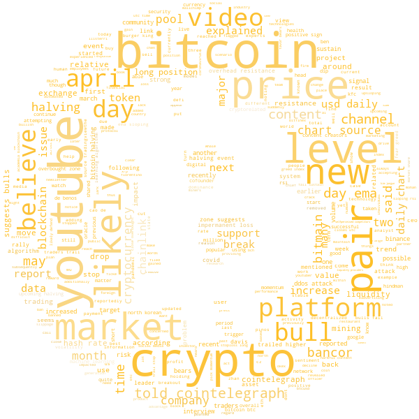

# Web Scraping and Wordcloud

In this project I used python for Web Scraping to create a wordcloud with the content of 10 recent articles from Coin Telegraph website (https://cointelegraph.com/).

Result:

That was just for fun, but what if I say that someday I want to know the trending words from this page or maybe any website. That would be great! My thanks to @DataScienceAcademy and @Datacamp for the helping content :)
